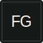
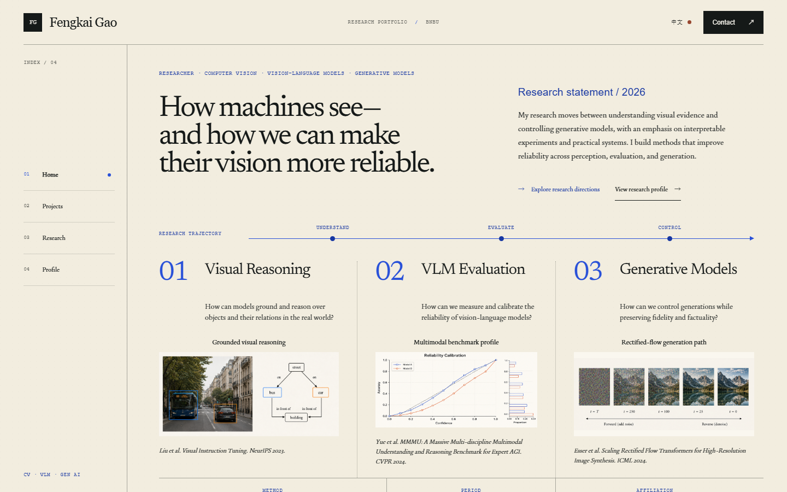

<div align="center">
  <a href="https://qcytsn.github.io">
    
  </a>
  <h1>Fengkai Gao · AI Research Portfolio</h1>
  <p><strong>Computer vision, vision-language model evaluation, and controllable generative models.</strong></p>
  <p>
    <a href="https://qcytsn.github.io">Live portfolio</a> ·
    <a href="https://peanut-ai.dev">Primary site</a> ·
    <a href="https://github.com/QCYTSN">GitHub profile</a>
  </p>
  <p>
    <a href="https://github.com/QCYTSN/qcytsn.github.io/actions/workflows/deploy-pages.yml"></a>
    
    
    
  </p>
</div>

<a href="https://qcytsn.github.io">
  
</a>

## About

This repository contains my bilingual, interactive research portfolio. It presents selected work in scientific-figure integrity, controllable image generation, and diffusion-model analysis, alongside small interactive demonstrations of the ideas behind the research.

The experience is available in English and Chinese and is designed to make research outcomes, methods, and model behavior easy to explore.

## Selected work

| Project | Focus | Resources |
| --- | --- | --- |
| Semantic Manipulation in Academic Figures | Benchmark design, VLM evaluation, structured visual reasoning | [Report](./public/papers/semantic-figure-manipulation.pdf) · [Code](https://github.com/QCYTSN/DSMAF_Light) |
| Detection-Guided Attention Control | Training-free control, cross-attention, concept disentanglement | [Report](./public/papers/detection-guided-attention.pdf) · [Code](https://github.com/QCYTSN/Training-Free-Concept-Disentanglement-in-T2I-Generation-via-Detection-Guided-Attention-Control) |
| Dynamic FreeU | Frequency analysis, U-Net features, dynamic modulation | [Report](./public/papers/dynamic-freeu.pdf) |

## Portfolio features

- Bilingual English and Chinese content
- Interactive research demos for visual reasoning, VLM evaluation, and generative models
- Responsive layouts, motion controls, and keyboard-friendly interactions
- Project reports and code links collected in one place
- Automatic deployment to GitHub Pages from `main`

## Built with

- [Next.js 16](https://nextjs.org/) and [React 19](https://react.dev/)
- [TypeScript](https://www.typescriptlang.org/) and [Tailwind CSS 4](https://tailwindcss.com/)
- [Vinext](https://github.com/cloudflare/vinext), [Vite](https://vite.dev/), and [Cloudflare Workers](https://workers.cloudflare.com/)
- Optional [Cloudflare D1](https://developers.cloudflare.com/d1/) and [Drizzle ORM](https://orm.drizzle.team/) integration

## Run locally

Requirements: Node.js `>=22.13.0` and a Bash-compatible environment such as Linux, macOS, Git Bash, or WSL.

```bash
git clone https://github.com/QCYTSN/qcytsn.github.io.git
cd qcytsn.github.io
npm ci
npm run dev
```

Then open the local URL printed by Vite.

Useful commands:

```bash
npm run dev          # start the development server
npm run lint         # run ESLint
npm run typecheck    # check TypeScript
npm test             # run the full validation suite
npm run build:pages  # create the static GitHub Pages build
npm run build        # create and validate the Worker build
```

## Deployment

The same source supports two deployment targets:

| Target | URL | Build |
| --- | --- | --- |
| GitHub Pages | [qcytsn.github.io](https://qcytsn.github.io) | `npm run build:pages` |
| Primary site | [peanut-ai.dev](https://peanut-ai.dev) | `npm run build` |

Pushes to `main` are built and published to GitHub Pages by [GitHub Actions](./.github/workflows/deploy-pages.yml). The Worker build is prepared through Vinext for the primary deployment.

## Repository map

```text
app/                  portfolio pages, content, and interactions
public/images/        portfolio artwork and research figures
public/papers/        project reports
db/                   optional D1 and Drizzle setup
scripts/              build and validation helpers
tests/                content and rendered-output checks
.github/workflows/    GitHub Pages deployment
```

## Contact

Fengkai Gao · [GitHub](https://github.com/QCYTSN) · [Email](mailto:t330034007@mail.bnbu.edu.cn)
